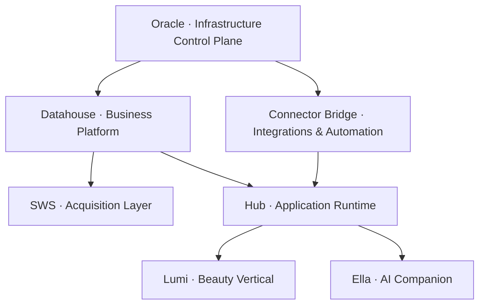
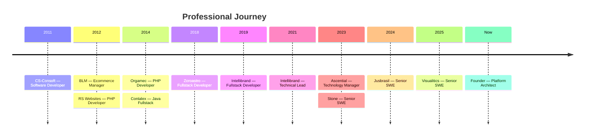

<div align="center">

# Victor Mendonça

**Principal Software Engineer · Platform Architect · AI Systems**

Building ecosystems, data platforms, and AI-native products that matters.

<br/>


[](https://www.linkedin.com/in/vicmendonca/)

</div>

---

## About

Software engineer, platform architect, and technical leader with **15+ years** designing and operating scalable SaaS platforms, distributed systems, and AI-native products across **fintech, legaltech, retail intelligence, and data-intensive applications**.

My work is about turning fragmented systems, workflows, and data into cohesive platforms that support multiple products, domains, and business models. Lately my focus sits at the intersection of **AI systems** — agentic workflows, RAG, MCP — and the **data and integration infrastructure** that makes them dependable in production.

I move comfortably between hands-on engineering and technical strategy: leading teams and setting architecture, while still writing the code that proves the hard parts work.

---

## What I'm building now

A unified, white-label **SaaS ecosystem** that combines infrastructure control planes, multi-tenant runtimes, universal connectors, data acquisition at scale, workflow automation, and AI services — designed so a single platform can power many products and verticals.



<table>
<tr>
<td valign="top" width="50%">

**Oracle** — `shared control plane`
<br/>Orchestration, shared databases, AI infra, vector search, observability.

**Connector Bridge** — `integration & cognition`
<br/>Universal connectors, canonical schemas, ETL, RAG, automation.

</td>
<td valign="top" width="50%">

**Datahouse** — `acquisition + application`
<br/>Large-scale scraping, anti-bot, proxy orchestration, multi-tenant runtime.

**Lumi / Ella** — `vertical & AI products`
<br/>AI-native CRM for beauty pros; a local-first AI companion.

</td>
</tr>
</table>

---

## Core Expertise

| Area | Focus |
|---|---|
| **Platform Architecture** | SaaS · Distributed systems · DDD · Event-driven · System design |
| **AI & Intelligence** | LLMs · Agentic systems · RAG · MCP · Vector search · Knowledge systems |
| **Data Platforms** | Data engineering · ETL · Analytics · Warehousing · Observability |
| **Leadership** | Engineering strategy · Platform strategy · Product engineering · Mentorship |

---

## Industries


---

## Tech Stack

**Languages**


**Frontend**


**Backend**


**Data**


**Infrastructure**


**AI & Automation**


---

## Experience



<br/>

<details>
<summary><b>Founder & Platform Architect</b> — White-Label SaaS Ecosystem · 2023–Present</summary>

<br/>

Designing and operating a unified SaaS ecosystem spanning AI, integrations, automation, data acquisition, and vertical applications. Ownership across platform architecture, product strategy, infrastructure, AI systems, data platforms, and engineering standards.

</details>

<details>
<summary><b>Senior Software Engineer</b> — Visualitics · 2025</summary>

<br/>

Unified commerce-intelligence platform consolidating operational data from marketplaces, ad networks, and analytics providers.

- Connector architecture and ETL pipelines across **ADS**, **Selling** and **Marketplace** apps
- Analytics engines with **BigQuery** warehousing and distributed processing
- Chrome Extension architecture for in-context data capture

</details>

<details>
<summary><b>Senior Software Engineer</b> — Jusbrasil · 2024–2025</summary>

<br/>

Large-scale infrastructure for reliable web access and data acquisition.

- Designed and optimized **proxy infrastructure and routing** for fast, dependable retrieval
- Strengthened **observability and reliability** across services
- Implemented cost-efficient strategies that reduced operational spend without sacrificing quality
- Built internal tooling that improved developer experience and throughput

</details>

<details>
<summary><b>Senior Software Engineer</b> — Stone · 2023–2024</summary>

<br/>

Fintech systems for payment processing, merchant acquiring, and financial services for SMEs.

- Backend services, APIs, and microservices for **high-volume transaction processing**
- Integrations with payment gateways, banking APIs, and fraud-detection systems
- Performance, latency, and scalability optimization under strict reliability and compliance standards

</details>

<details>
<summary><b>Technology Manager</b> — Ascential · 2023</summary>

<br/>

Led engineering for digital trade-marketing and e-commerce intelligence platforms serving global brands.

- Directed architecture, data pipelines, analytics platforms, and cloud infrastructure for large-scale retail data
- Defined roadmaps and established quality and operational standards
- Delivered across three solution areas: **retail analytics**, **content & compliance**, and **store locator** tooling

</details>

<details>
<summary><b>Technical Lead → Fullstack Developer</b> — Intellibrand · 2019–2023</summary>

<br/>

Drove the design and scalability of data-driven platforms for retail intelligence and digital trade marketing.

- Architected **real-time retail intelligence** for large-scale collection, processing, and analytics across thousands of digital touchpoints
- Integrated cloud, AI/ML, and data-pipeline tech to improve pricing intelligence and shelf visibility
- Mentored engineers and established engineering best practices

</details>

<details>
<summary><b>Earlier career</b> — 2011–2019</summary>

<br/>

| Company | Role | Focus |
|---|---|---|
| Zoroastro Advogados | Fullstack Developer | Legal ops, workflow automation, financial systems (Node, Angular, Mongo) |
| Contalex | Java Web Fullstack | ERP SaaS for accounting firms (Java, Spring, Hibernate) |
| Orgamec | PHP Developer | Internal business-process automation |
| RS Websites | PHP Developer | Web apps, systems, and ERP (PHP, Laravel, MySQL) |
| BLM | Ecommerce Manager | Digital commerce + a geolocation/Bluetooth Android app |
| CS-Consoft | Developer | Desktop / RIA software |

</details>

---

## How I think about engineering

> Simple scales.

> Architecture is a business decision.

> Operational excellence beats cleverness.

> Data is a platform, not a byproduct.

> AI should amplify humans.

> Build systems that are easier to operate than to explain.

---

<div align="center">

**Designing systems that outlive the applications built on top of them.**

Open to conversations with recruiters, partners, and prospective co-founders.

[](https://www.linkedin.com/in/vicmendonca/)
[](mailto:victor.mendonca@live.com)

</div>

```txt
                                      _  _
                            _____*~~~  **  ~~~*_____
                         __* ___     |\__/|     ___ *__
                       _*  / 888~~\__(8OO8)__/~~888 \  *_
                     _*   /88888888888888888888888888\   *_
                     *   |8888888888888888888888888888|   *
                    /~*  \8888/~\88/~\8888/~\88/~\8888/  *~
                   /  ~*  \88/   \/   (88)   \/   \88/  *~
                  /    ~*  \/          \/          \/  *~
                 /       ~~*_                      _*~~/
                /            ~~~~~*___ ** ___*~~~~~  /
               /                      ~  ~         /
              /                                  /
             /                                 /
            /                                /
           /                    ___sws___  /
          /                    | ####### |
         /            ___      | ####### |             ____i__
        /  _____p_____l_l____  | ####### |            | ooooo |         qp
i__p__ /  |  ###############  || ####### |__l___xp____| ooooo |      |~~~~|
 oooo |_I_|  ###############  || ####### |oo%Xoox%ooxo| ooooo |p__h__|##%#|
 oooo |ooo|  ###############  || ####### |o%xo%%xoooo%| ooooo |      |#xx%|
 oooo |ooo|  ###############  || ####### |o%ooxx%ooo%%| ooooo |######|x##%|
 oooo |ooo|  ###############  || ####### |oo%%x%oo%xoo| ooooo |######|##%x|
 oooo |ooo|  ###############  || ####### |%x%%oo%/oo%o| ooooo |######|/#%x|
 oooo |ooo|  ###############  || ####### |%%x/oo/xx%xo| ooooo |######|#%x/|
 oooo |ooo|  ###############  || ####### |xxooo%%/xo%o| ooooo |######|#^x#|
 oooo |ooo|  ###############  || ####### |oox%%o/x%%ox| ooooo |~~~$~~|x##/|
 oooo |ooo|  ###############  || ####### |x%oo%x/o%//x| ooooo |_KKKK_|#x/%|
 oooo |ooo|  ###############  || ####### |oox%xo%%oox%| ooooo |_|~|~~|xx%/|
 oooo |oHo|  #####AAAA######  || ##XX### |x%x%WWx%%/ox| ooDoo |_| |Y||xGGx|
 ~~~~~~~~~~~~~~~~~~~~~~~~~~~~~~~~~~~~~~~~~~~~~~~~~~~~~~~~~~~~~~~~~~~~~~~~~~
```
