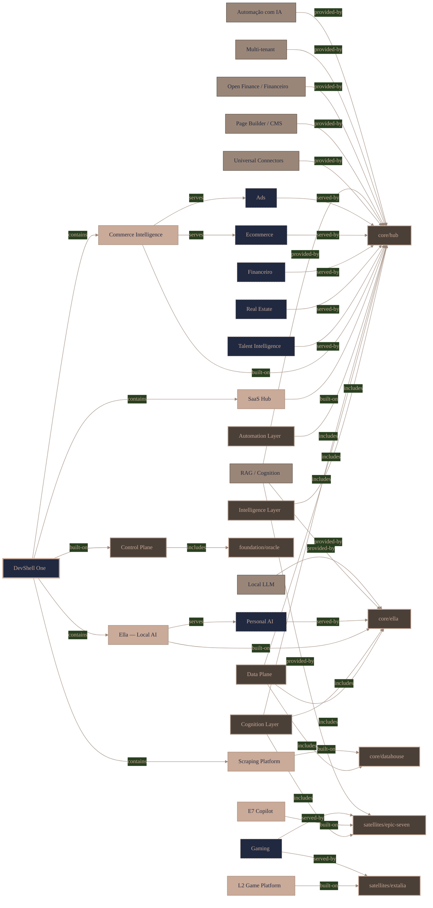
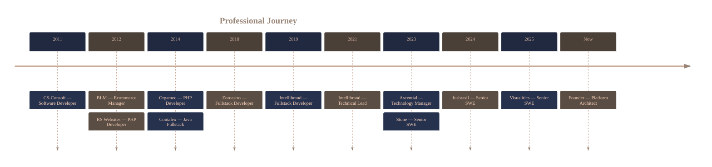

<!--
  Palette (Color Hunt 2029404b40389a8678caaa98):
  #202940 navy  ·  #4B4038 brown  ·  #9A8678 taupe  ·  #CAAA98 sand
  Badge bg = 202940 / logo = CAAA98 / accent = 9A8678 / second tone = 4B4038
-->

<div align="center">

# Victor Mendonça

**Principal Software Engineer · Platform Architect · AI Systems**

I build platforms that turn fragmented data, integrations, and processes into operational intelligence — and lead the teams and architecture behind them.

<br/>


[](https://www.linkedin.com/in/vicmendonca/)
[](cv-en-us.pdf)
[](cv-pt-br.pdf)

[](https://mend3.github.io/mend3/)
[](https://mend3.github.io/mend3/ella.html)

</div>

---

## Executive Summary

Software engineer, platform architect, and technical leader with **15+ years** designing, building, and operating the platforms that companies run on — multi-tenant SaaS, distributed systems, large-scale data acquisition, and AI-native products.

One thread connects the work across **fintech, legaltech, retail & commerce intelligence, and data-intensive platforms**: taking fragmented data, integrations, and processes and turning them into **operational intelligence** — systems a business operates on, not dashboards it looks at. I did it consolidating millions of pricing signals for global brands; I'm doing it now in **DevShell One**, where many products share one foundation.

I operate across the full arc — **set the architecture and strategy, then write the code that de-risks the hardest parts** — and I treat structural decisions as business decisions: every one tied to cost, reliability, or speed-to-market.

---

## Selected platform — what I'm building now

**DevShell One** — a platform where one shared foundation powers many products and verticals, instead of rebuilding infrastructure, data, and AI for each. It spans an infrastructure control plane, a multi-tenant runtime, universal connectors, data acquisition at scale, workflow automation, and a native AI layer. The point isn't the parts — it's that **the cost of the next product, vertical, or tenant keeps falling**.

<!-- KT:PROFILE:START -->

<!-- KT:PROFILE:END -->

<sub>↑ <a href="https://mend3.github.io/mend3/">Mapped from the real system I architect and operate</a> (vision → products → domains → capabilities → projects) — explore it live.</sub>

<table>
<tr>
<td valign="top" width="50%">

**Oracle** — `shared control plane`
<br/>One foundation every product runs on — orchestration, shared data, AI infra, observability — so a new product ships without rebuilding infrastructure.

**Hub** — `application runtime`
<br/>The multi-tenant runtime where a whole vertical becomes a module: connectors, CMS/page builder, workflow automation, scheduling. Many products, one codebase.

</td>
<td valign="top" width="50%">

**Datahouse** — `acquisition layer`
<br/>Reliable supply of external data at scale — resilient crawling, anti-bot, proxy orchestration — the raw material the rest of the platform reasons over.

**Ella** — `AI layer`
<br/>The AI that understands the *whole* system — memory, knowledge retrieval, agentic actions — so any function is operable by conversation, with data staying on the company's own infrastructure.

</td>
</tr>
</table>

---

## Platform Domains

The kinds of systems I design and own end-to-end — each framed by the problem it solves, not the stack it runs on.

| Domain | What it does for the business |
|---|---|
| **Multi-tenant SaaS** | One platform serving many customers and verticals — new products ship as modules, not rewrites. |
| **Data acquisition at scale** | Reliable supply of external data when the web fights back — the raw material for any intelligence. |
| **Integration ecosystems** | Many systems made to behave as one, on a single canonical data model — no more silos that disagree. |
| **AI & agentic systems** | AI that understands the whole operation and can act on it — function by conversation, decisions with context. |
| **Operational intelligence** | Fragmented signals turned into what to do next — pricing, shelf, performance, growth. |
| **Reliability & cost** | Systems easier to operate than to explain — observable, resilient, and cheaper to run over time. |

---

## Selected Platform Achievements

- **Designed and operate DevShell One end-to-end** — control plane, data acquisition, integration framework, workflow automation, AI layer, and vertical apps — proving one foundation can power many products at a falling marginal cost.
- **Built retail & commerce-intelligence platforms processing millions of pricing, inventory, and merchandising signals** across global marketplaces, used by global consumer brands to steer pricing, availability, and digital-shelf strategy.
- **Architected large-scale, cost-efficient web-access and data-acquisition infrastructure** with reliability and observability as first-class concerns — cutting operational spend without sacrificing quality.
- **Delivered high-volume payments and financial systems** under strict reliability and compliance constraints, at one of Latin America's largest acquirers.
- **The consistent thread across fintech, legaltech, retail intelligence, and data platforms:** turning fragmented data, integrations, and processes into operational intelligence.

---

## Industries


---

## Experience



Different industries, one trajectory: from building data and commerce-intelligence platforms for global brands, to owning the architecture of DevShell One. The constant is **platforms, data, integrations, and operational intelligence** — each role a deeper cut at the same problem.

<br/>

<details>
<summary><b>Founder & Platform Architect</b> — DevShell One · 2023–Present</summary>

<br/>

**Built:** **DevShell One** — a single platform where one shared foundation powers many products: control plane, data acquisition, integration framework, workflow automation, native AI layer, and vertical apps.
**Problem:** every new product or vertical normally means rebuilding infrastructure, data, and AI from scratch.
**Impact:** verticals now ship as modules on a shared base, so the marginal cost of the next product, tenant, or market keeps falling — and the AI understands the whole operation because everything lives on one data model.

Ownership across architecture, product strategy, infrastructure, AI systems, data platforms, and engineering standards.

<sub>TypeScript · Node.js · Next.js · PostgreSQL · Redis · Kubernetes · local LLMs · event-driven architecture</sub>

</details>

<details>
<summary><b>Senior Software Engineer</b> — Visualitics · 2025–Present</summary>

<br/>

**Built:** the integration and processing core of a commerce-intelligence platform that consolidates marketplace, advertising, and analytics data into a single decision layer — surfaced in-workflow through web apps and a browser extension.
**Problem:** sellers' performance data is scattered across a dozen marketplaces and ad networks that never agree.
**Impact:** one place to see and act on the whole operation, with insight delivered where the work already happens.

Owned multi-source ingestion, distributed processing, ETL, and KPI computation across Mercado Livre, Shopee, Amazon, VTEX, NuvemShop, GA4, Meta and Google Ads.

<sub>Node.js · TypeScript · FastAPI · BigQuery · Redis · GCP · browser-extension architecture</sub>

</details>

<details>
<summary><b>Senior Software Engineer</b> — Jusbrasil · 2024–2025</summary>

<br/>

**Built:** the large-scale web-access and data-acquisition infrastructure behind the company's intelligence operations — proxy and routing architecture for fast, dependable retrieval at scale.
**Problem:** reliable data acquisition gets expensive and brittle as volume and anti-bot pressure grow.
**Impact:** materially lower operational spend with stronger reliability — and internal tooling that lifted the whole team's throughput.

Reliability, resiliency, observability, and developer-experience work as first-class concerns.

<sub>Node.js · TypeScript · Kubernetes · Redis · PostgreSQL · observability platforms</sub>

</details>

<details>
<summary><b>Senior Software Engineer</b> — Stone · 2023–2024</summary>

<br/>

**Built:** backend services and integrations for high-volume payment processing and merchant acquiring at one of Latin America's largest acquirers.
**Problem:** money movement tolerates no downtime, no data loss, and no compliance gaps — at scale.
**Impact:** dependable, low-latency financial flows that hold under strict reliability and regulatory constraints.

Distributed systems, payment and banking integrations, and performance optimization under fintech-grade requirements.

<sub>Node.js · TypeScript · distributed systems · cloud infrastructure</sub>

</details>

<details>
<summary><b>Technology Manager</b> — Ascential · 2023</summary>

<br/>

**Led:** engineering for the digital commerce-intelligence platforms used by global consumer brands — architecture, data pipelines, analytics, and cloud infrastructure for large-scale retail data.
**Problem:** global brands can't see how they're really performing across thousands of digital shelves.
**Impact:** enabled those brands to optimize pricing, availability, search visibility, and digital-shelf performance — set the roadmap and the quality and operational standards behind it.

Engineering leadership across retail analytics, content & compliance, and store-locator tooling.

<sub>Distributed data platforms · analytics pipelines · cloud infrastructure</sub>

</details>

<details>
<summary><b>Technical Lead → Fullstack Developer</b> — Intellibrand · 2019–2023</summary>

<br/>

**Built & led:** large-scale retail-intelligence platforms processing **millions of pricing, inventory, and merchandising signals** across global retailers and marketplaces — as Tech Lead, owned scalability, data ingestion, pricing intelligence, and digital-shelf analytics.
**Problem:** pricing and shelf decisions were made blind, across too many channels to track by hand.
**Impact:** turned a flood of fragmented signals into real-time intelligence brands could act on — and grew the engineering team and standards that sustained it.

Where the through-line started: fragmented data → operational intelligence, at scale.

<sub>Node.js · TypeScript · data pipelines · cloud · AI/ML</sub>

</details>

<details>
<summary><b>Earlier career</b> — 2011–2019</summary>

<br/>

| Company | Role | Focus |
|---|---|---|
| Zoroastro Advogados | Fullstack Developer | Legal ops, workflow automation, financial systems (Node, Angular, Mongo) |
| Contalex | Java Web Fullstack | ERP SaaS for accounting firms (Java, Spring, Hibernate) |
| Orgamec | PHP Developer | Internal business-process automation |
| RS Websites | PHP Developer | Web apps, systems, and ERP (PHP, Laravel, MySQL) |
| BLM | Ecommerce Manager | Digital commerce + a geolocation/Bluetooth Android app |
| CS-Consoft | Developer | Desktop / RIA software |

</details>

---

## Technical Leadership

- **Full-arc ownership** — set architecture and technical strategy, then write the code that de-risks the hardest parts. I don't hand off the unknown.
- **Force-multiplier engineering** — establish the standards, review culture, and platform conventions that let a small team ship like a much larger one.
- **Grew people and direction** — mentored engineers and owned roadmaps and technical decisions as Tech Lead and Technology Manager.
- **Architecture as a business lever** — every structural decision tied to a concrete outcome: lower cost, higher reliability, or faster time-to-market.

---

## Architecture Expertise

| | |
|---|---|
| **Platforms** | Multi-tenant SaaS · distributed & event-driven systems · domain-driven design · system design |
| **Data & integration** | Connector frameworks · canonical data modeling · ETL & analytical pipelines · large-scale acquisition |
| **AI-native** | Agentic systems · retrieval-augmented generation · knowledge systems · vector search · local-first inference |
| **Operations** | Reliability & observability · cost engineering · infrastructure as a shared control plane |

---

## Industries


---

## Tech Stack

**Languages**


**Frontend**


**Backend**


**Data**


**Infrastructure**


**AI & Automation**


---

## How I think about engineering

> Simple scales.

> Architecture is a business decision.

> Operational excellence beats cleverness.

> Data is a platform, not a byproduct.

> AI should amplify humans.

> Build systems that are easier to operate than to explain.

---

<div align="center">

**Designing systems that outlive the applications built on top of them.**

Open to conversations with recruiters, partners, and prospective co-founders.

[](https://www.linkedin.com/in/vicmendonca/)
[](mailto:victor.mendonca@live.com)

[](cv-en-us.pdf)
[](cv-pt-br.pdf)

</div>

```txt
                                      _  _
                            _____*~~~  **  ~~~*_____
                         __* ___     |\__/|     ___ *__
                       _*  / 888~~\__(8OO8)__/~~888 \  *_
                     _*   /88888888888888888888888888\   *_
                     *   |8888888888888888888888888888|   *
                    /~*  \8888/~\88/~\8888/~\88/~\8888/  *~
                   /  ~*  \88/   \/   (88)   \/   \88/  *~
                  /    ~*  \/          \/          \/  *~
                 /       ~~*_                      _*~~/
                /            ~~~~~*___ ** ___*~~~~~  /
               /                      ~  ~         /
              /                                  /
             /                                 /
            /                                /
           /                    ___sws___  /
          /                    | ####### |
         /            ___      | ####### |             ____i__
        /  _____p_____l_l____  | ####### |            | ooooo |         qp
i__p__ /  |  ###############  || ####### |__l___xp____| ooooo |      |~~~~|
 oooo |_I_|  ###############  || ####### |oo%Xoox%ooxo| ooooo |p__h__|##%#|
 oooo |ooo|  ###############  || ####### |o%xo%%xoooo%| ooooo |      |#xx%|
 oooo |ooo|  ###############  || ####### |o%ooxx%ooo%%| ooooo |######|x##%|
 oooo |ooo|  ###############  || ####### |oo%%x%oo%xoo| ooooo |######|##%x|
 oooo |ooo|  ###############  || ####### |%x%%oo%/oo%o| ooooo |######|/#%x|
 oooo |ooo|  ###############  || ####### |%%x/oo/xx%xo| ooooo |######|#%x/|
 oooo |ooo|  ###############  || ####### |xxooo%%/xo%o| ooooo |######|#^x#|
 oooo |ooo|  ###############  || ####### |oox%%o/x%%ox| ooooo |~~~$~~|x##/|
 oooo |ooo|  ###############  || ####### |x%oo%x/o%//x| ooooo |_KKKK_|#x/%|
 oooo |ooo|  ###############  || ####### |oox%xo%%oox%| ooooo |_|~|~~|xx%/|
 oooo |oHo|  #####AAAA######  || ##XX### |x%x%WWx%%/ox| ooDoo |_| |Y||xGGx|
 ~~~~~~~~~~~~~~~~~~~~~~~~~~~~~~~~~~~~~~~~~~~~~~~~~~~~~~~~~~~~~~~~~~~~~~~~~~
```
